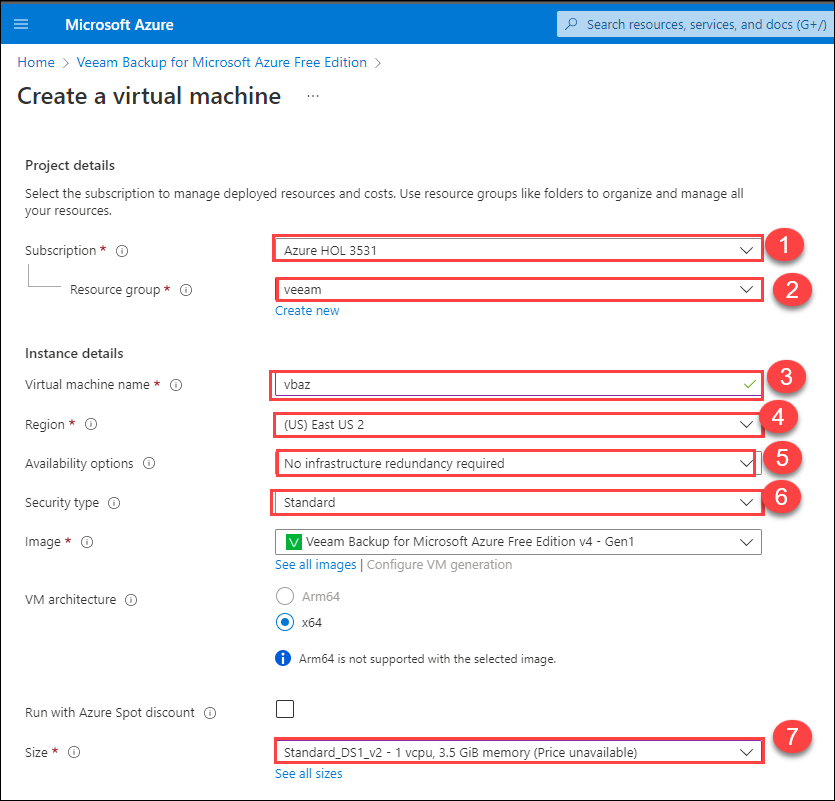
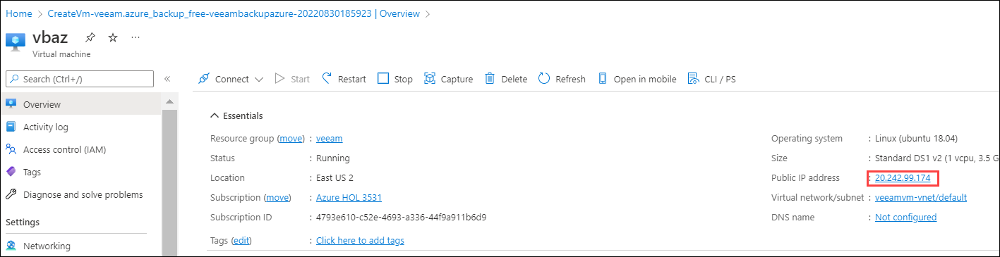
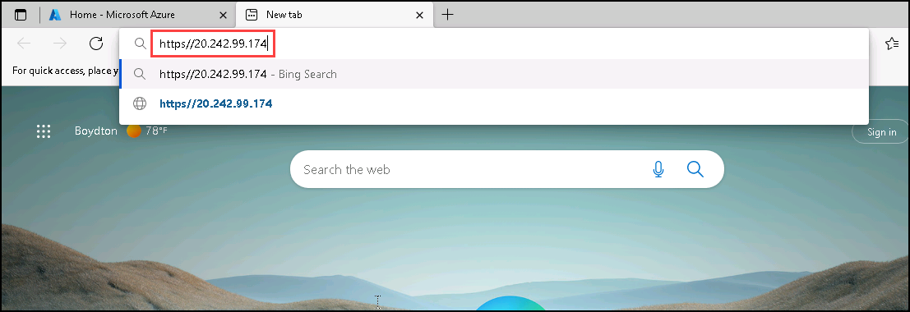

# Exercise 2: Access and Configure Veeam Backup for Microsoft Azure

## Overview

In this exercise, you will deploy a Veeam Virtual machine to configure Backup for MS Azure, and also you will add Microsoft Azure Account, Workers to Workspace, and Repository to the Virtual Machine.

## Task 1: Provision of Veeam Virtual Machine

1. After login into the Azure Portal, search for ****Veeam Backup for Microsoft Azure Free Edition** (1)** in the search bar and click on **Veeam Backup for Microsoft Azure Free Edition (2)** under **Marketplace**.

    
    
1. Click on **Create**.

    
    
1. On the **Basics** tab of **Create virtual machine**, enter the following information:

    - **Subscription (1)**: Select your Subscription
    - **Resource Group (2)**: Select the resource group **Veeam** from the drop-down list
    - **Virtual machine name (3)**: Enter the name **vbaz**
    - **Region (4)**: Select **<inject key="Region" enableCopy="false"/>** from the drop-down list
    - **Availability options (5)**:  Choose **No infrastructure redundancy required**
    - **Security type (6)**: Select **Standard**
    - **Size (7)**: Choose **Standard_DS1_V2**

        
        
    - **Authentication type (8)** Select **Password**
    - **Username (9)**: Enter **<inject key="VM Admin Username" enableCopy="true"/>**
    - **Password (10)**: Enter **<inject key="VM Admin Password" enableCopy="true"/>**
    - **Confirm password (11)**: Enter **<inject key="VM Admin Password" enableCopy="true"/>**
    - Click on **Review + Create (12)**

        

1. Review the configuration and click on **Create**.

    
     
1. Once the deployment is successful, click on **Go to resource**.

    

1. From the **Overview** tab, copy the **Public Ip address**.

    
    
    
   **Note**: Wait for 10 minutes before processed to next step

1. Open the new/incognito browser and paste the value copied below and replace the **IPADDRESS** with the **Veeam VM Public IP Address**.

     ```
     https://IPADDRESS
     ```
     
     
1. Click on the **Advanced**.

   
   
1. Click on **continue to IP (unsafe)** to access the website.

   
   
1. On the **Veeam Backup for Microsoft Azure** page, provide the below credentials and click on **Login (3)**.

    - **Username (1)**: Enter **<inject key="VM Admin Username" enableCopy="true"/>**
    - **Password (2)**: Enter **<inject key="VM Admin Password" enableCopy="true"/>**
    
    

1. Check the boxes next to all **Licence agreements (1)** and click on **Accept (2)**.

        

## Task 2: Configure a Microsoft Azure Account.

1. On the **Veeam Backup for Microsoft Azure** page, click on **Add a Microsoft Azure account first**.

    
    
1. On **Azure Accounts** tab, click on **+ Add**.

   
   
1. On the **Add Azure Account** page, enter the below information:

    - **Name**: Enter **AzureBackup (1)**
    - **Description**: Enter **Add a Microsoft Azure Account (2)**
    - Click on **Next (3)**

    
    
1. Under **Service Account Type (1)** choose **Specify existing service account (2)** and then click on **Next (3)**.

    
    
1. Navigate to **Environment details**, click on **Service principle Credentials** and copy the **Application Id (Client Id)** , **Secret Key** , **Tenant Id**.

    
    
1. Paste the values that you copied in the respective fields under the **Service Account** tab and click on **Next**.

    
    
1. On the **Summary** tab, click on **Finish** to set up the Microsoft account.

     
   
## Task 3: Add the workers to Workspace

1. Navigate back to **Getting Started (1)** tab and click on **Review workers configuration (2)**.

    
    
1. Under **Network** tab, click on **+ Add**.

    
   
1. Click on **Choose** **(1)** next to Region and select the region **<inject key="Region" enableCopy="false"/>** **(2)** then click on **Apply** **(3)**.

    
    
1. After selecting the region, click on **Next**.

    
    
1. On the **Specify network settings** tab, follow the below instructions:

   - **Virtual network**: Select **veeamvm-vnet (1)**
   - **Subnet**: Leave it as **default (2)**
   - **Network security Group**: Select **Veeam-nsg (3)**
   - Click on **Next (4)**

    
    
1. Review the configured settings under **Summary** and click on **Finish**.

    
    
1. On **Workers** **(1)** tab, navigate to **Profile** **(2)** and click on **+ Add** **(3)**.

    
    
1. Under **Available regions**, select the region **<inject key="Region" enableCopy="false"/> (1)** click on **Add (2)** then click on **Next (3)**.

    
    
1. Under **Worker Profiles**, leave everything default and click on **Next**.

    
    
1. Review the configuration under the **Summary** tab and click on **Finish**.

    
     
# Task 4: Add the repository

1. Navigate back to **Getting Started (1)** tab and click on **Add repository (2)**.

   
   
1. Under **Repository (1)**, click on **+ Add (2)**.

    
    
1. Under the **Add Repository** page, follow the below instructions:

    - **Name**: Enter **AzureBackup (1)**
    - **Description**: Enter **Creation of repository (2)**
    - Click on **Next (3)**

     
     
1. Under the **Settings** page, follow the below instructions:

    - Location:

        - **Storage account** : Select **veeamstr<inject key="DeploymentID" enableCopy="false"/> (1)**
        - **Container** : Select **veeamcontainer (2)**

    - Folder :

       - **Create new folder** : Enter **azurebackup (4)**

 1. Click on **Next (5)**

     
     
1. Leave default under **Options** and click on **Next**.

    
   
1. Review the configuration under **Summary** and click on **Finish**.

      

1. Under **Session Log (1)**, verify the status of **Create repository** type is **Success (2)**.

    

Now you have successfully configured the VEEAM Backup for MS Azure!!
