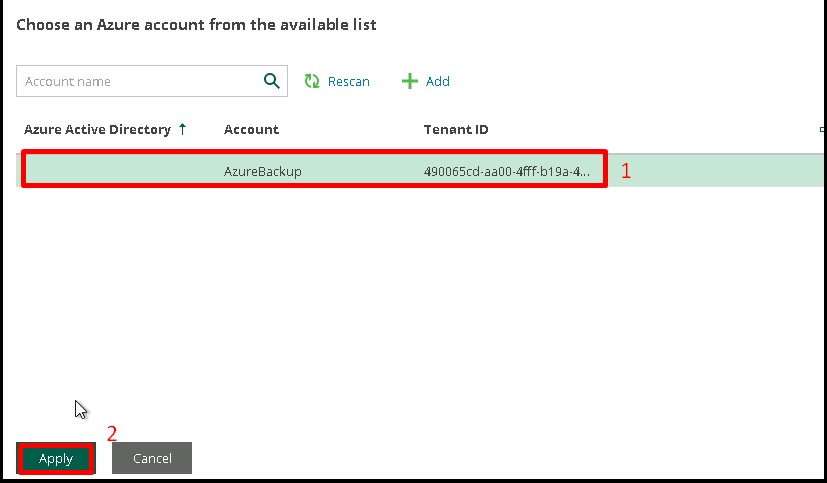

# Exercise 3 : Create Backup policy for VMS

Veeam Backup for Microsoft Azure performs VM backup in the following way:

Veeam Backup for Microsoft Azure creates snapshots of virtual disks that are attached to the processed Azure VM.
Disk snapshots are assigned Azure tags upon creation. Keys and values of Azure tags contain encrypted metadata that helps Veeam Backup for Microsoft Azure identify the related disk snapshots and treat them as a single unit — a cloud-native snapshot.

If you enable image-level backup for the backup policy, Veeam Backup for Microsoft Azure performs the following operations:
Launches a worker instance in an Azure region in which a processed Azure VM resides.
By default, Veeam Backup for Microsoft Azure launches worker instances using automatically created virtual network. However, you can add specific worker configurations.

Reads data from a cloud-native snapshot, transfers the data to a backup repository and stores it in the native Veeam format.
To reduce the amount of data read from snapshot, Veeam Backup for Microsoft Azure uses the changed block tracking (CBT) mechanism: during incremental backup sessions, Veeam Backup for Microsoft Azure compares the new cloud-native snapshot with the previous one and reads only those data blocks that have changed since the previous backup session.

Deallocates the worker instance when the backup session completes
## Overview

In this exercise you will create the backup for both Linux and Windows virtual Machine.

## Task 1 : Create Backup policy for Virtual Machine

1. Click on **Configuration(1)** in the upper left corner of screen, click on **Getting started page(2)** and **Create your first policy(3)**

2. Click on **+Add**

3. Under **Policy Info(1)** section enter the Name: **Virtual Machine Backup** and Description: **Creation of Backup for virtual Machine** and click on **Next**

4. Select the **Sources** and Click on **Select Azure Active Directory**

5. Select the directory and Click on **Apply**

6. Select the **Sources** and Click on **Choose regions**

7. Select the region of resource group and click **Add**

8. Click on **Apply**

9. Select the **Sources** and Click on **select resources to protect**

10. Select the **protect the following resources** and click on **Browse to select the specific source from the global list**

11. Select the checkboxes for both **VeeamLinux-DID** and **winVM-DID** and **ADD**

12. Click on **Apply**

13. Click on **Next**

14. Under **Guest processing** section enable the feature **Enable application-aware snapshots** and click **Next**

15. Under **Targets** section **Enable Backups: On** click **Next**.

16. Under **Schedule** section, enable **Daily retention: On** and click om **Edit Daily Settings**

17. Select the **Repository : Azure Backup** and Click on **Apply** 

18. click on **Next**.

19. Under **Settings** leave defaults and click on **Next**.

20. Select the **Cost Estimation** and review the cost estimation and click **Next**

21. Review the **Summary** section and click on **Finish**

22. Move to **policies**, click on **Virtual Machine**, Check the **priority** and click on **Start**

23. Wait Untill the Backup is **Success**

