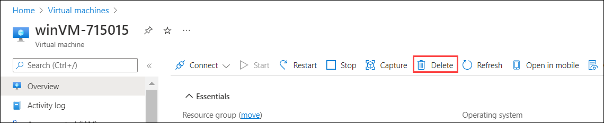
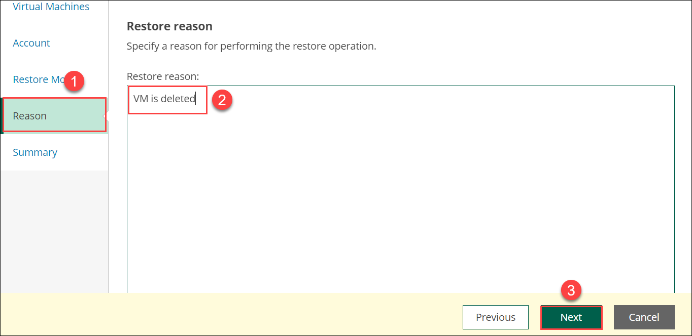
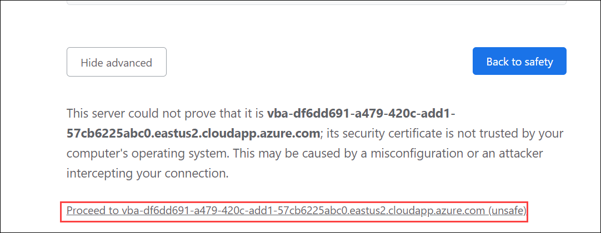

# Exercise 4: Delete and Restore Virtual machines

## Overview

In this exercise, we are working on the recovery of the Windows and Linux virtual machine.

## Task 1: Deleting the Windows virtual machine

1. Navigate back to the Azure portal and search for **virtual machine(1)** and click on **Virtual machines(2)**.

   
 
2. Select the **winVM-<inject key="DeploymentID" enableCopy="false"/>**.

   

3. Click on **Delete**.

   

4. Select the **winVM-<inject key="DeploymentID" enableCopy="false"/>(1)**, check the checkbox for **I have read and understand that this virtual machine as well as any selected associated resources listed above will be deleted(2)** and click on **Delete(3)**.

   

5. Wait until deletion is completed.

## Task 2: Recovery of Windows virtual machine

1. Navigate back to the **Veeam Backup for Microsoft Azure** page Move to **Protected Data(1)**, click on **Virtual Machines(2)** tab and then click on **check box for winVM-<inject key="DeploymentID" enableCopy="false"/>(3)**. Now click on **Restore(4)** and click on **VM Restore(5)**

   

2. In **Virtual Machines(1)** tab, click on **winVM-<inject key="DeploymentID" enableCopy="false"/>(2)** and click on **Next(3)**.

   

3. Move to **Account(1)** and click on **Select account(2)**.

   

4. Select the **AzureBackup(1)** account and click on **Apply(2)**.

   

5. Click on **Next**.

   

6. Move to **Restore Mode(1)**, enable the radio button for **Restore to the original location(2)** and click on **Next(3)**.

   

   >**Note**: If you see the below warning popup, click on **continue**.

   

7. In **Reason(1) session**, add Restore reason as **VM is deleted(2)** and click on **Next(3)**.

   

8. Verify the **Summary(1)** and click on **Restore(2)**.

   

9. In the **Session Log(1)** and make sure that **VM Restore** is **Success(2)**.
 
   

## Task 3: Recovery of files from Linux Virtual Machine

1. In the **Protected Data(1)**, click on **Virtual Machines(2)** and then click on **check box for VeeamLinuxVM-DID(3)**. Now click on **Restore(4)** and click on **File-Level Recovery(5)**.

   

2. In the **Virtual Machine(1)** pane, click on **VeeamLinuxVM-<inject key="DeploymentID" enableCopy="false"/>(2)** and click **Next(3)**.

   

3. Now in the **Reason(1)** pane, add Restore reason as: **File restore(2)** and click on **Next(3)**.

   

4. Verify the **Summary(1)** and click on **Start(2)**.

   

   >**Note**: Wait for 10 minutes before processed to next step

5. In the **Protected Data(1)**, click on **Virtual Machines(2)** and then under **File-Level Recovery URL(3)** and click on **FLR(4)**.

   

6. Click on **URL**
  
   

7. Click on **Advanced**

   

8. Click on **Processed to ....**

   

9. Under folder named **disk_0_0**, select the folders **var/lib/waagent/custom-script/download/0** and check the checkbox for file **text1.txt(1)**. Then click on **Add to Restore List(2)**

   

10. Move to **Restore List(1)**, check the checkbox for **text1(2)** and click on **Download(3)**

    
