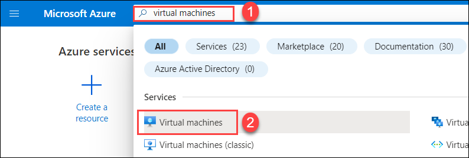
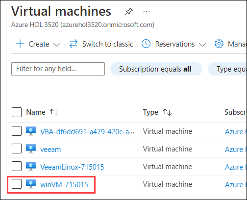
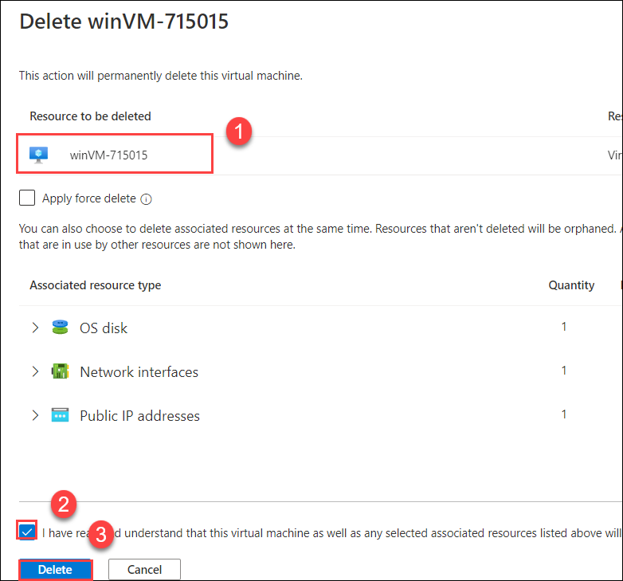

# Exercise 4: Delete and Restore Windows  and Linux VM

## Overview
In this exercise we are working on the recovery of the windows and linux virtual machine.

## Task 1: Deleting of the Windows virtual machine
1. Move back to the azure portal search for **virtual machine(1)** and click on **virtual machine(2)**

2. Select the **winVM-DID**

3. Click on **delete**

4. Select the **winVM-DID(1)**, check the checkbox for the **I have read and understand that this virtual machine aswell as any selected associated resources listed above will be deleted(2)** and click **Delete(3)**

5. Wait Untill deletion is completed.

## Task 2: Recovery of Windows virtual machine
