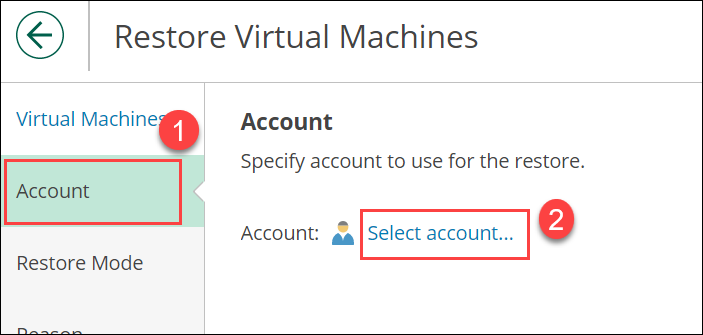
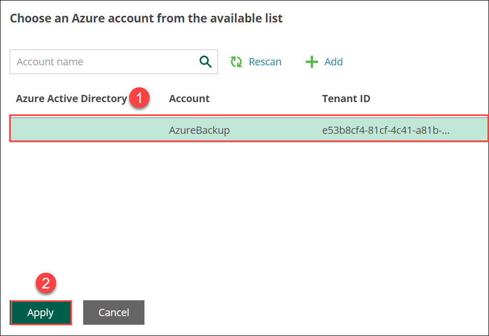
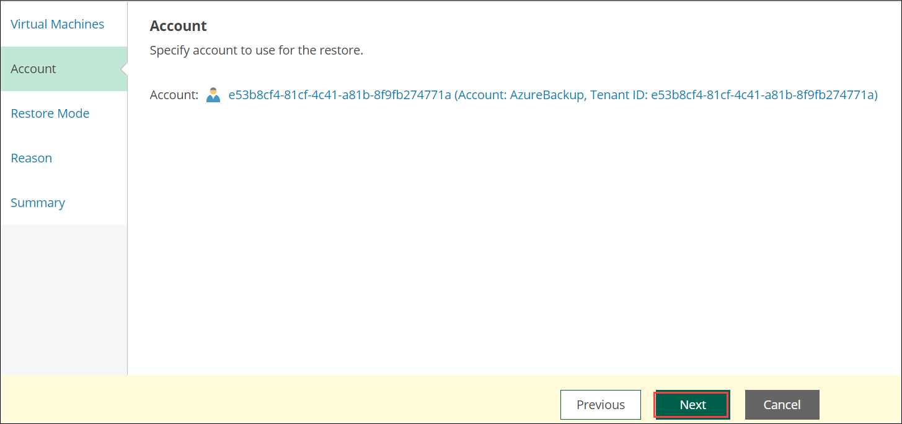
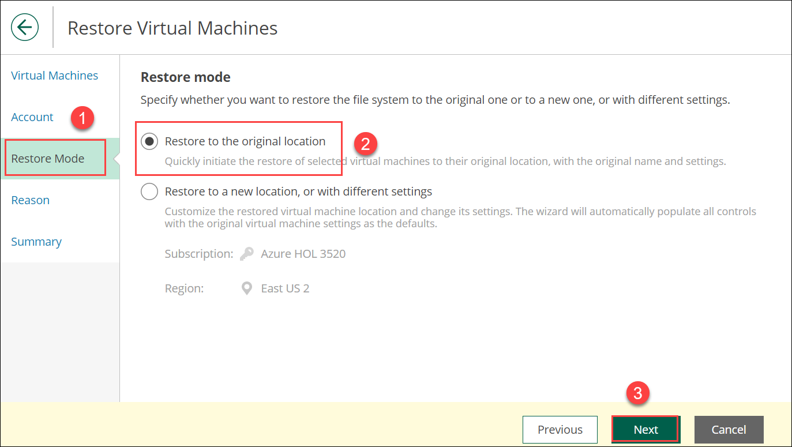
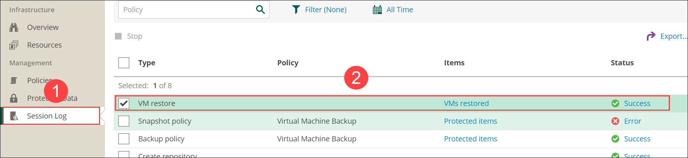

# Exercise 4: Delete and Restore Windows  and Linux VM

## Overview
In this exercise we are working on the recovery of the windows and linux virtual machine.

## Task 1: Deleting of the Windows virtual machine
1. Move back to the azure portal search for **virtual machine(1)** and click on **virtual machine(2)**

2. Select the **winVM-DID**

3. Click on **delete**

4. Select the **winVM-DID(1)**, check the checkbox for the **I have read and understand that this virtual machine aswell as any selected associated resources listed above will be deleted(2)** and click **Delete(3)**

5. Wait Untill deletion is completed.

## Task 2: Recovery of Windows virtual machine
1. Move to **Protected Data(1)**, click on **Virtual Machines(2)**, click on **check box for winVM-DID(3)**, click on **Restore(4)** and click on **VM Restore(5)**

2. Move to **Virtual Machines(1)**, Click on **winVM-DID(2)** and Click on **Next(3)**.

3. Move to **Account(1)** and click on **Select account(2)**

4. Select the **AzureBackup(1)** account and click on **Apply(2)**

5. click on **Next**

6. Move to **Restore Mode(1)**, enable the radio button for **Restore to the orginal location(2)** and click on **Next(3)**

Note: If warning is popup click on **continue**

7. Move to **Reason(1)**, Restore reason : **VM is deleted(2)** and click on **Next(3)**

8. Move to **Summary(1)** and click on **Restore(2)**

9. Move to **Session log(1)** and make sure that **VM Restore** is **Success(2)**

