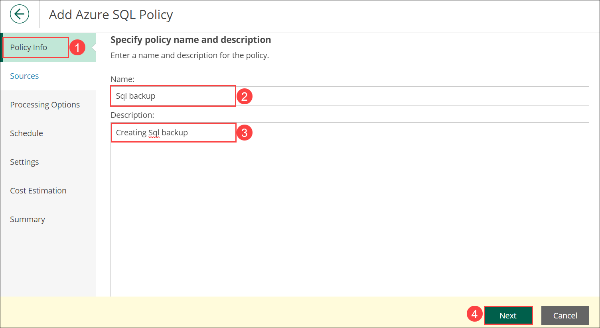
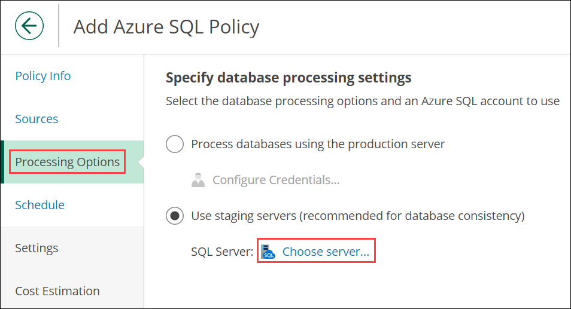
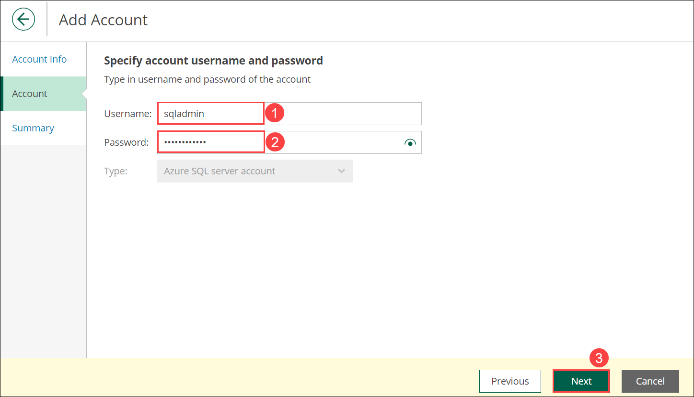

# Exercise 5: Add Azure SQL Backup

In this exercise, you will be adding Azure SQL Backup. Azure Backup offers a stream-based, specialized solution to back up SQL Server running in Azure VMs. This solution aligns with Azure Backup's benefits of zero-infrastructure backup, long-term retention, and central management.

## Task 1: Adding Azure SQL Backup

1. Navigate to **Policies** **(1)**, select the **Azure SQL** **(2)** and click **+Add** **(3)**.

   
   
2. Under **PolicyInfo** **(1)** section, enter value for Name as **Sql backup** **(2)** and Description as **Creating Sql backup** **(3)**. Then click on **Next** **(4)**.

   
   
3. In **Sources** **(1)** pane, click on **Select Azure Active Directory** **(2)**.

   
   
4. Select the available Azure account **(1)** and click on **Apply** **(2)**.

   
   
5. In the Sources pane, click on **Choose regions** under Region.

    

6. Select the **Resource Group Region** **(1)**, click on **Add** **(2)** and click on **Apply** **(3)**.

   

7. In Resources section, click on **Select resources to protect**.

   

8. In the Choose protection options pane, select **Protect the following resources** **(1)** and click on **Browse to select the specifid source from global list** **(2)**.

   

9. Select the **SamepleDB** **(1)** and click on **Add** **(2)**.

   

10. Click on **Apply** and click on **Next** in the Sources pane.

    

11. Under **Processing Options**, select **Use staging servers (recommended for database consistency)** and Click on **Choose server**.

    

12. For **Staging server**, choose the available server from the drop-down **(1)** and click on **+ Add** **(2)** for adding SQL account.

    

13. Provide the details to create Sql account **Name**: **Sql Account** **(1)** and **Description**: **Create Sql Account** **(2)** and click on **Next** **(3)**.

    

14. In the Account pane, enter the **Username**: **sqladmin** **(1)**, **Password**: **Sqlpass@1234** **(2)** and click on **Next** **(3)**.

    

15. Verify summary and click on **Finish**.

    

16. Select **Apply** and click on **Next** in the Processing Options pane.

    

17. Under **Schedule**, Enable radio button for **Daily retention** **(1)** and click on **Edit Daily Settings** **(2)**.

    

18. Scroll-down to **Repository**, select **AzureBackup** from the drop-down and click on **Apply**. Then click on **Next** in th Schedule pane.

    

19. Leave default values in the **Settings** pane and click on **Next**.

    

20. Leave default values in the **Cost Estimation** pane and click on **Next**.

    

21. Verify the Summary and click on **Finish**.

    

22. In the **Policies** pane, check the **Priority** **(1)** checkbox and then click on **Start** **(2)**.

    

23. Make sure that backup is **Success**, it might take 10-15 minutes.

    
