# Exercise 6: Delete and Restore SQL Database

## Overview

In this exercise, you will be deleting the created SQL database from Azure portal and restoring it from Veeam Backup.

## Task 1: Delete the SQL Database

1. Navigate back to Azure Portal. In the resource group named **veeam**, open the SQL database named **SampleDB**.

   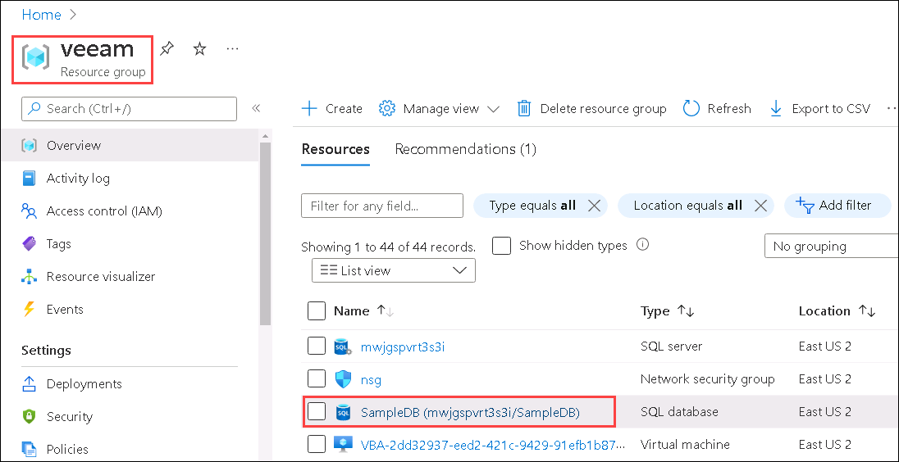

2. From the overview pane of **SampleDB**, click on **Delete**.

   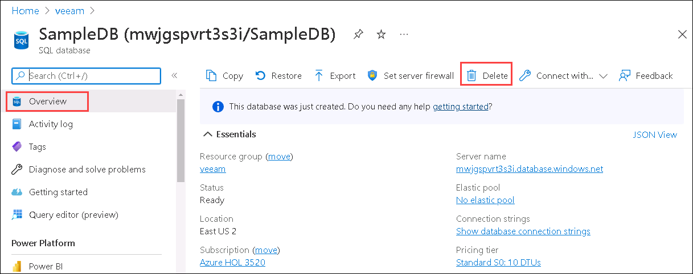

3. Pop-up will appear, type the database name and click on **Delete**

   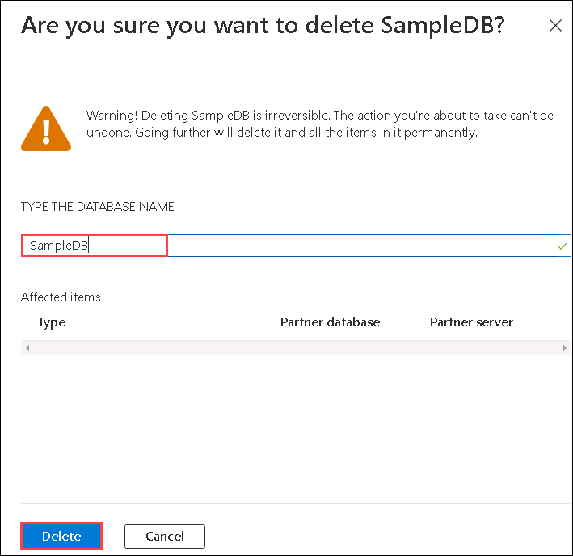

**Note**: Please wait until the deletion of SQL database is Successful.

## Task 2: Recovery of SQL Database

1. Navigate back to **Veeam Backup for Microsoft Azure** page. From the **Protected Data** **(1)**, select **Azure SQL** **(2)** option. Check the checkbox for **SamepleDB** **(3)** and click on **Restore Database** **(4)**.

   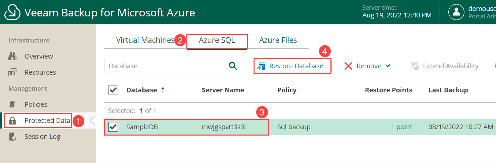

2. Under **Databases**, Select the **SQL database** **(1)** and Click on **Next** **(2)**.

   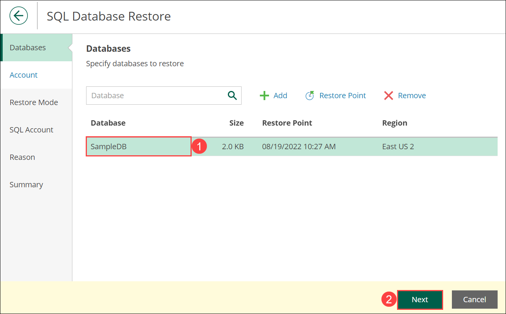

3. Under **Accounts**, click on **Select account** **(1)**, then choose an **Azure account** **(2)** and click on **Apply** **(3)**. Select **Next** in the **Accounts** pane.

   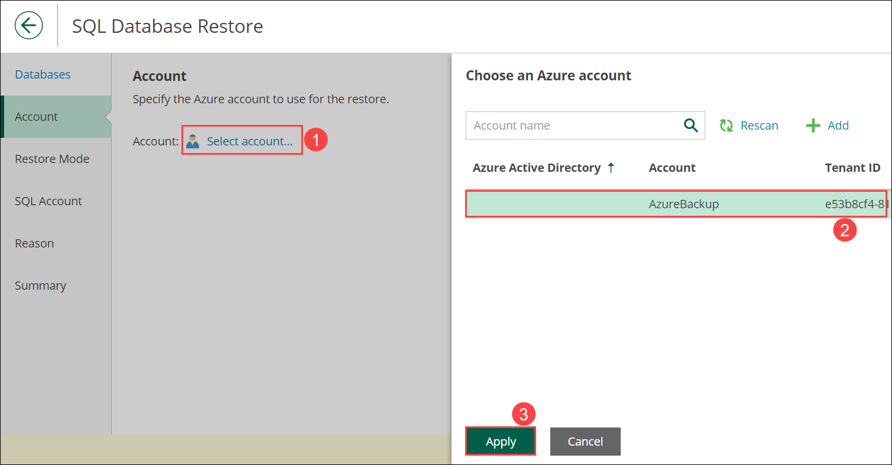
   
4. Leave default in the **Restore Mode** pane and click on **Next**.

   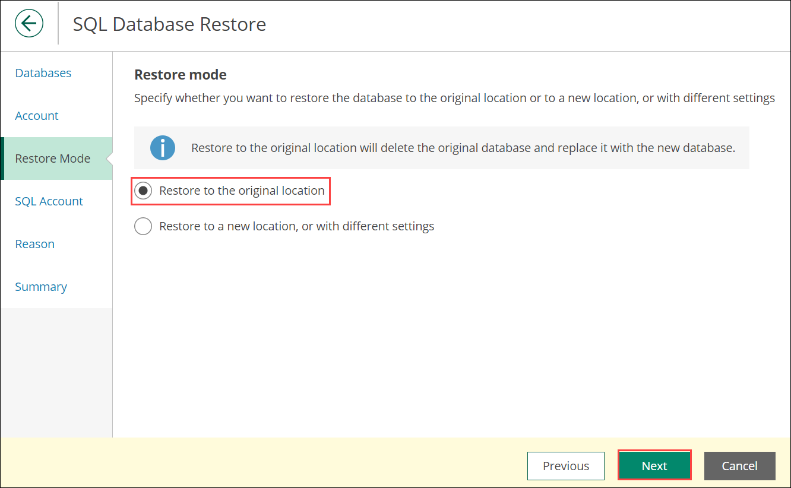

   **Note**: If warning window comes up then click on **Continue**.

5. Under **SQL Account** pane, click on **SqlAccount** **(1)** and choose an **sql account** **(2)** and click on **Apply** **(3)**. Select **Next** in the **SQL Account** pane.

   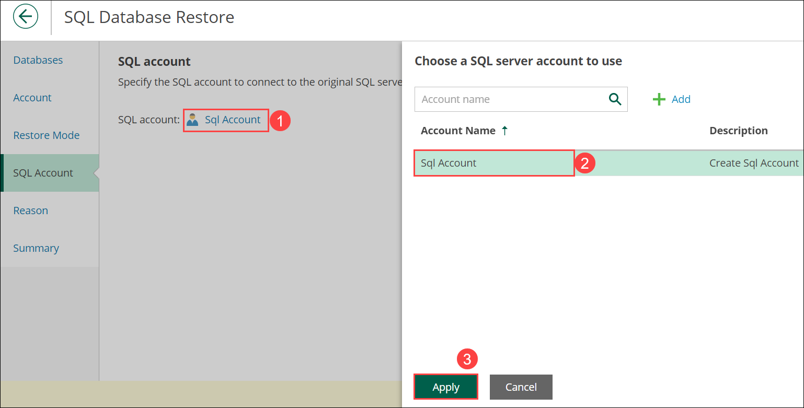

6. Under **Reason**, enter Restore reason as **SQL deleted** **(1)** and select **Next** **(2)**.

   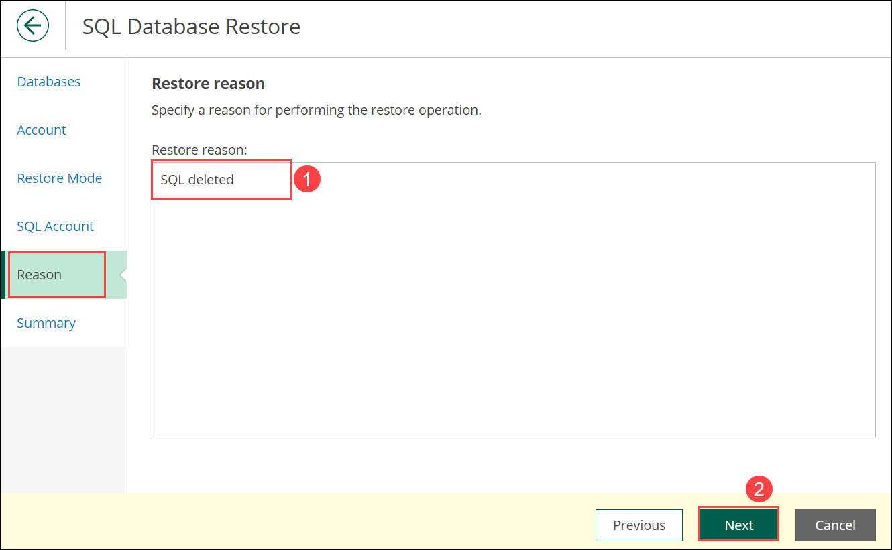
   
7. Verify the **Summary** and click on **Restore**.

   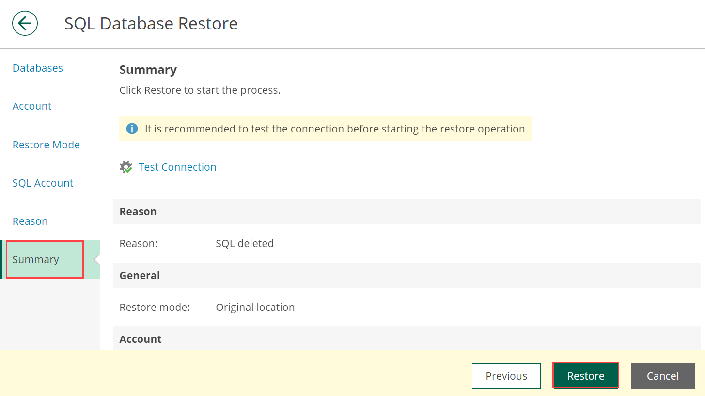

8. Select **Session Log** under Management in the left menu. You can verify that the SQL Restore Status is shown as **Success**, if not then wait until it gets succeeded, it might take 10 to 25 minutes.

   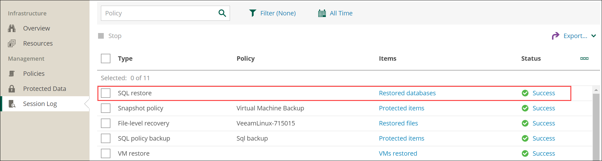

Now you have successfully restored SQL Database in Veeam!
