# Exercise 7: Backup of Azure File Share

## Overview
In this exercise, you are creating the backup for the Azure file share

## Task 1: Creating backup of azure file share
1. Move to **Policies(1)**, click on **Azure Files(2)** and click on **+Add(3)**
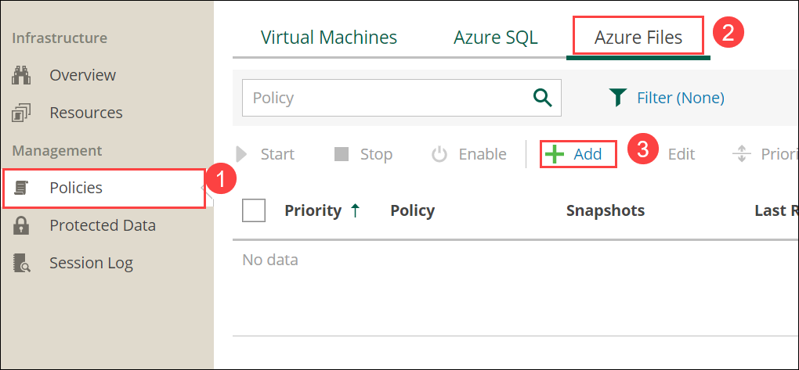
2. Move to **Info(1)**, provide the Policy Name as **azurebackup(2)** and Discripition as **azurebackup for files(3)**. select **Next(4)**.
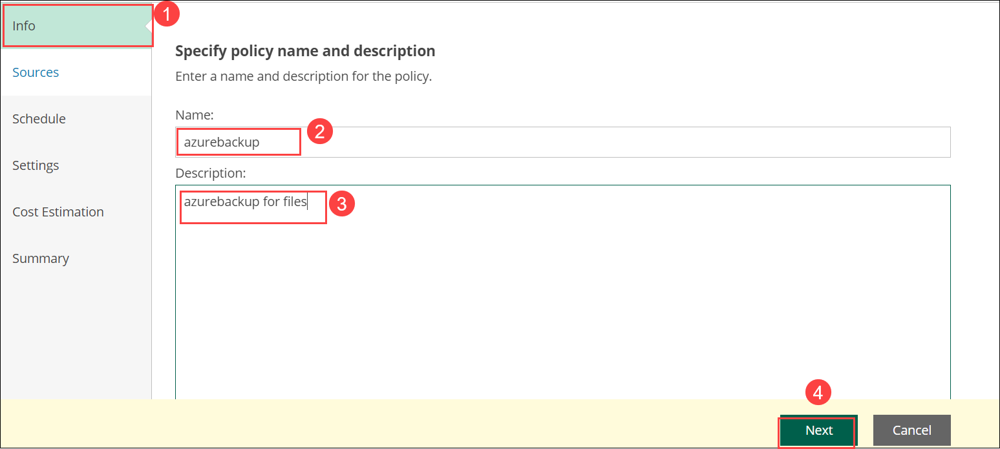
3. Move to **Sources(1)** and click on **Configure account(2)**
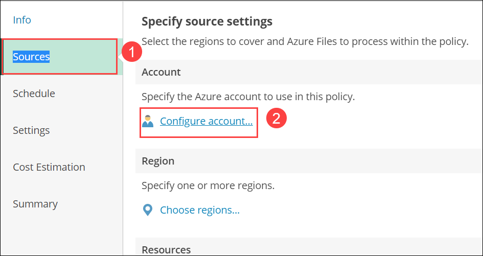
4. Select the account and click **Apply**
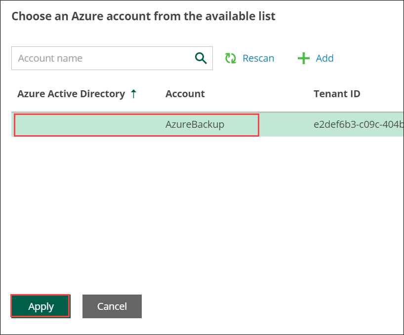
5. Select the **Sources(1)** and click on **choose regions..(2)**
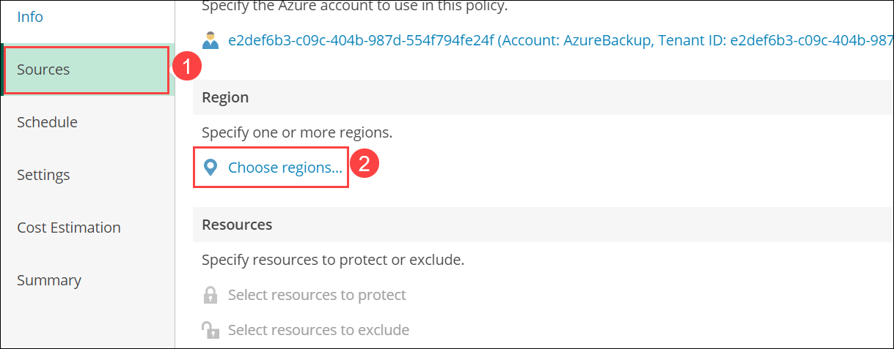
6. Select the Resource group region and click on **Add**
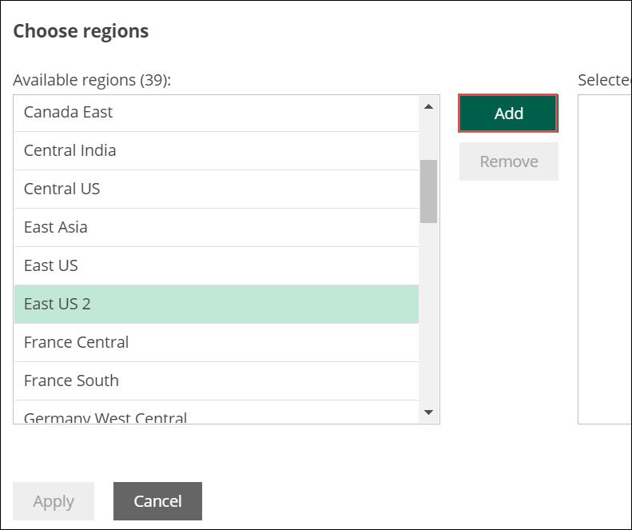
7. Click on **Apply**
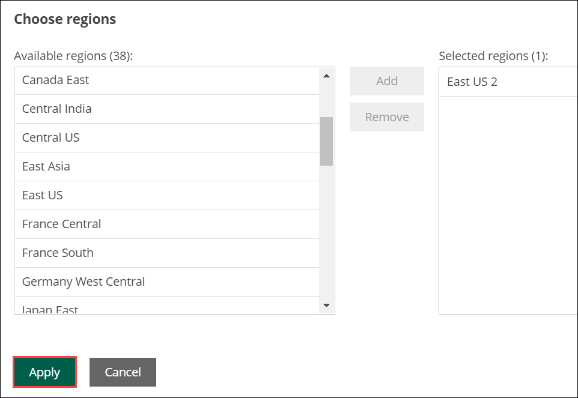
8. Select the **Sources(1)** and click 0n **select the resources to protect(2)**
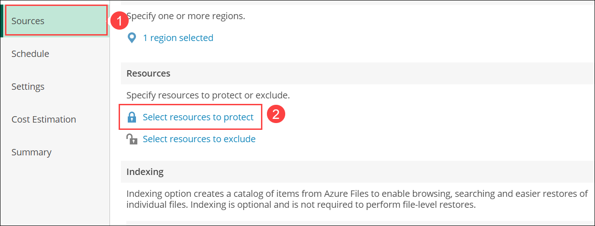
9. Click on **protect the following resources(1)** and click on **Browse to select the specific source from the global list(2)**
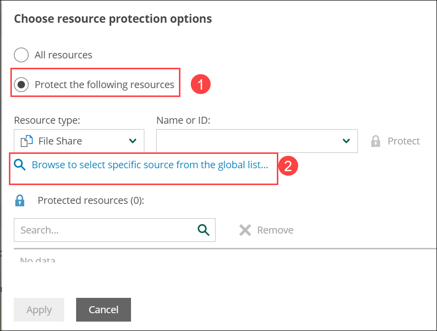
10. Check the checkbox for myshare and click on **Add**
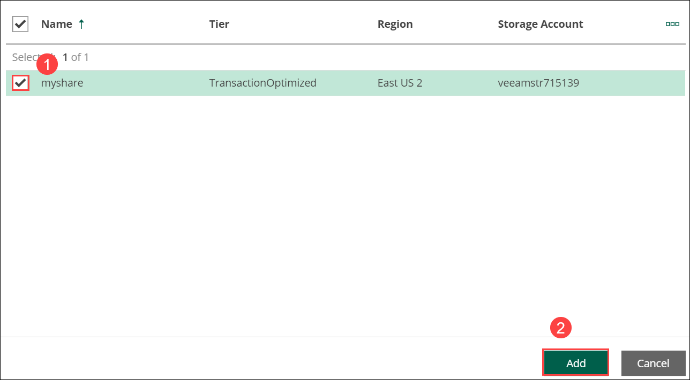
11. Click on **Apply**
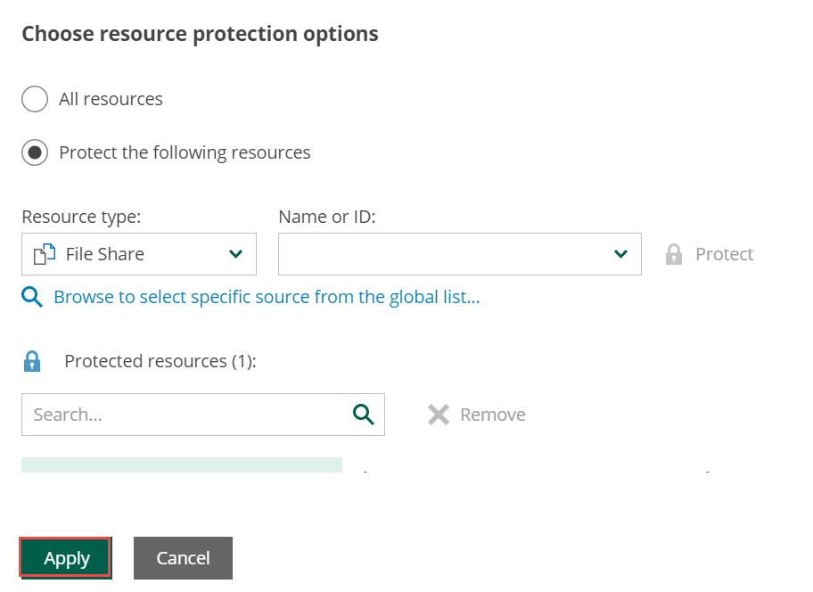
12. Click in **Next**
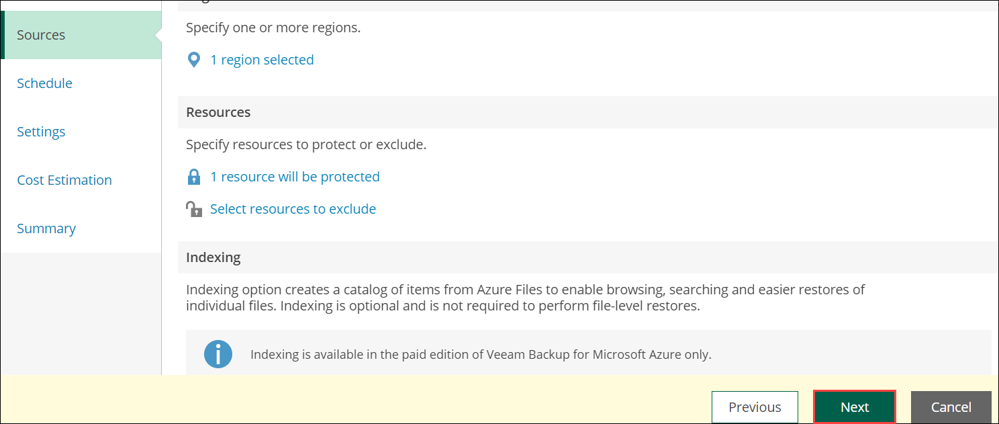
13. Under **Schedule(1)**, enable on option for **Daily retension(2)** and click on **Next(3)**.
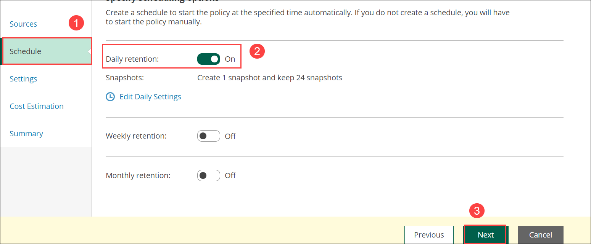
14. Leave defaults under **Settings(1)** and click on **Next(2)**
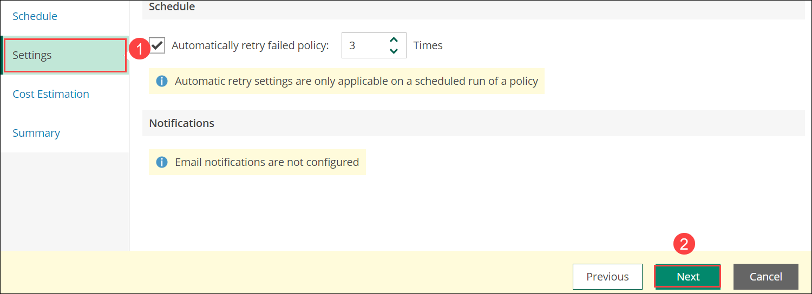
15. Under **cost Estimation(1)**, review the cost estimation and click on **Next(2)**.
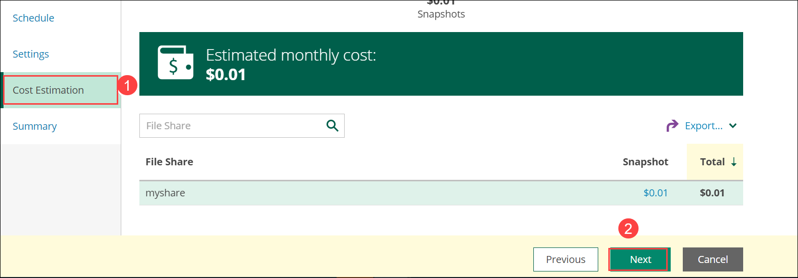
16. Under **Summary(1)**, click on **Finish(2)**
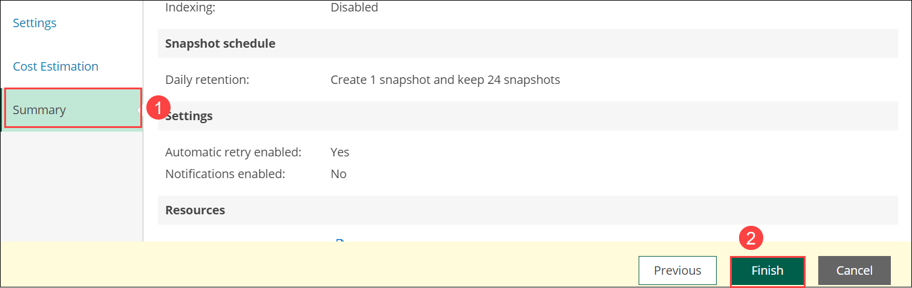
17. Under **Policies(1)**, within **Azure Files(2)**, check the **checkbox for azurebackup(3)** and Click on **Start(4)**.
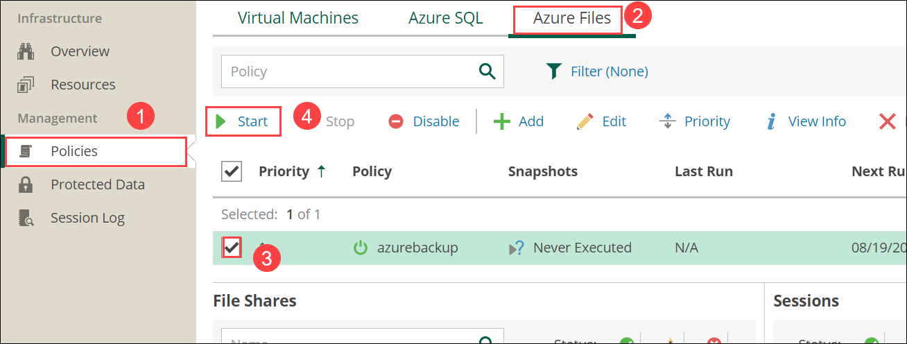
18. Make sure that backup is **success**
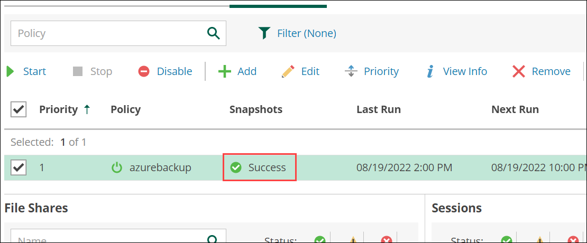
