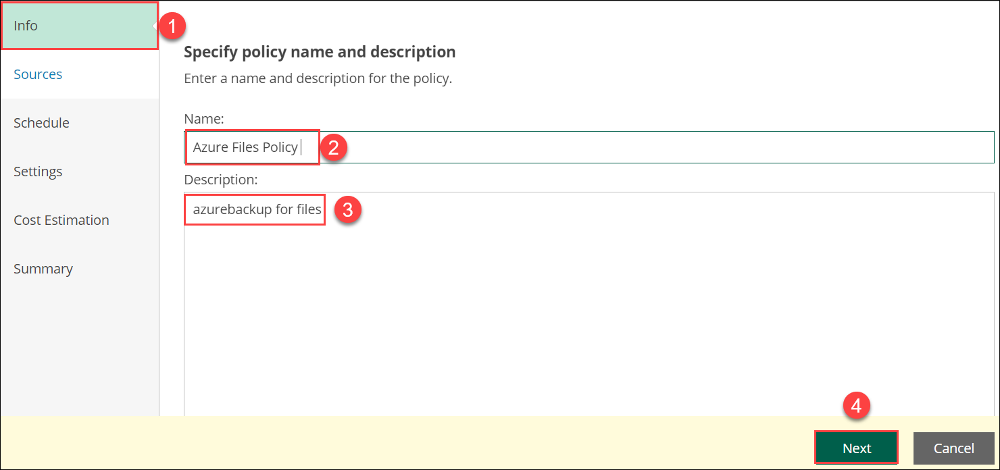
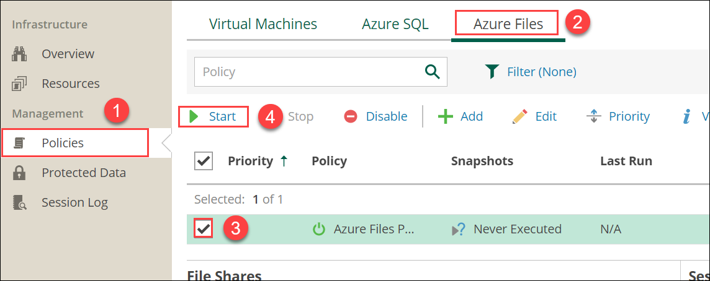
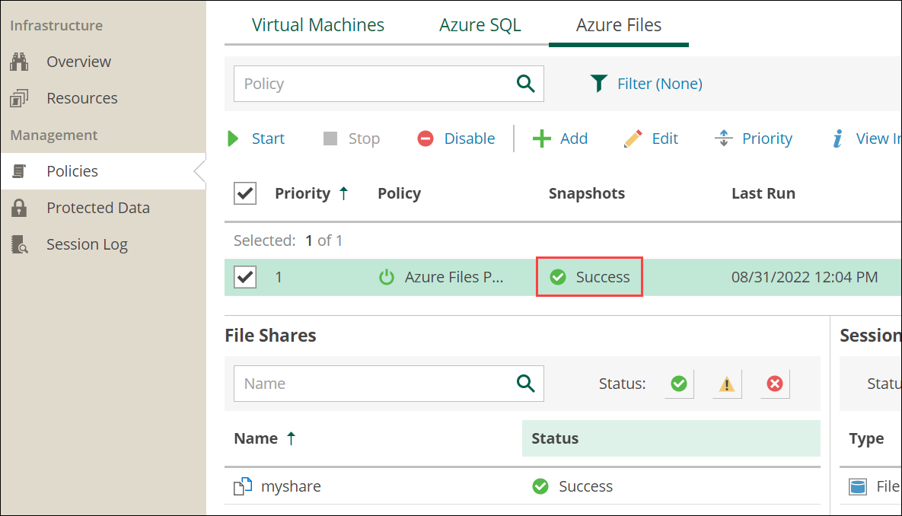

# Exercise 7: Backup of Azure File Share

## Overview

In this exercise, you are creating the backup for the Azure file share

## Task 1: Creating backup of azure file share

1. In the **Policies(1)** pane, click on **Azure Files(2)** and click on **+Add(3)**.

   

2. From the **Info(1)**, provide the Policy Name as **Azure Files Policy (2)** and Description as **azurebackup for files(3)**. Then select **Next(4)**.

   

3. In the **Sources(1)**, click on **Configure account(2)**.

   

4. Select the account and click **Apply**.

   

5. In the **Sources(1)** and click on **choose regions(2)**.

   

6. Select the Resource group region, **<inject key="Region" enableCopy="false"/>** and click on **Add**.

   

7. Click on **Apply**.

   

8. In the **Sources(1)** and click on **select resources to protect(2)**.

   

9. Click on **protect the following resources(1)** and click on **Browse to select the specific source from the global list(2)**.

   

10. Check the checkbox for myshare and click on **Add**.

    

11. Click on **Apply**.

    

12. Click on **Next**.

    

13. Under **Schedule(1)**, enable on option for **Daily retention(2)** and click on **Next(3)**.

    

14. Leave default in **Settings(1)** and click on **Next(2)**.

    

15. Under **Cost Estimation(1)**, review the cost estimation and click on **Next(2)**.

    

16. Verify **Summary(1)** and click on **Finish(2)**.

    

17. In the **Policies(1)** page, select **Azure Files(2)** and check the **checkbox for Azure Files Policy(3)** then click on **Start(4)**.

    

18. Make sure that backup is **success**.

    

Now you have successfully completed the backup the Azure File share using Veeam!
