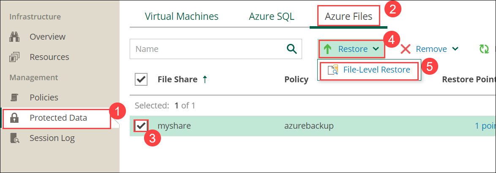
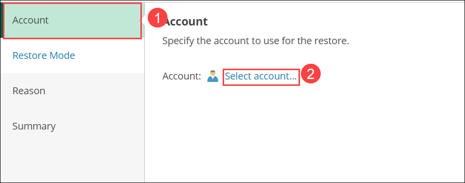
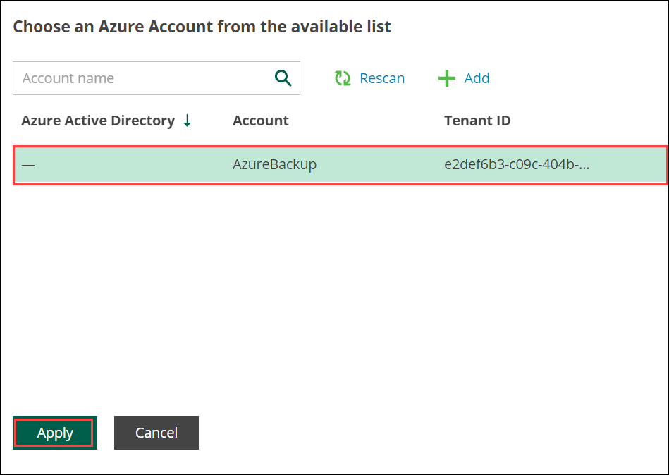
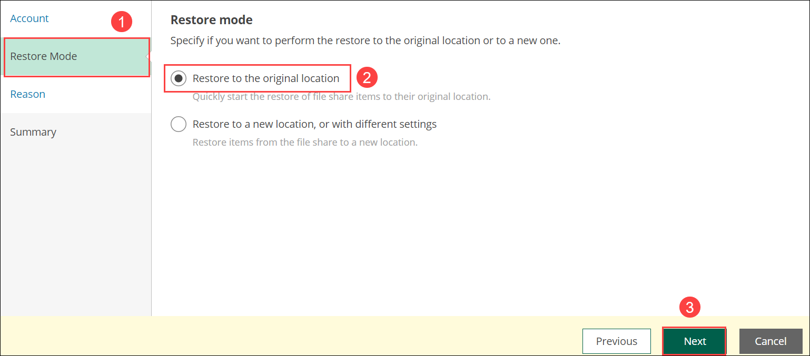
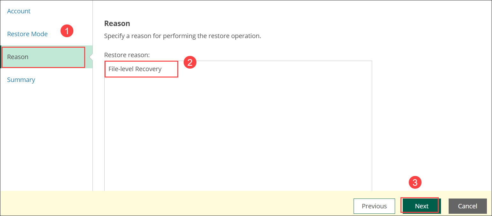
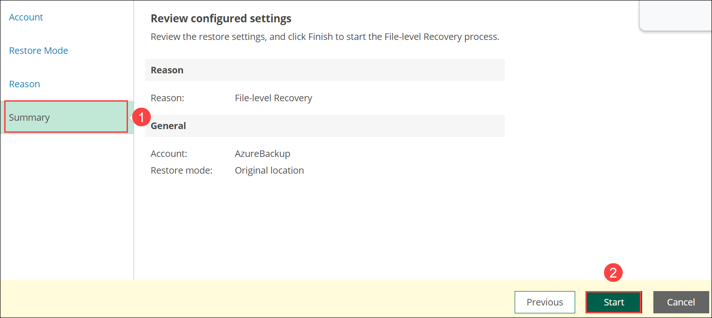
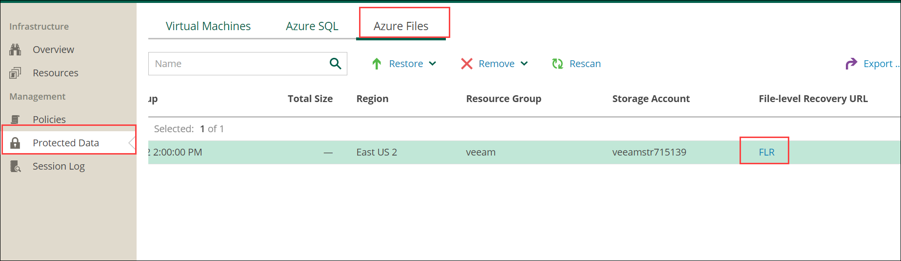
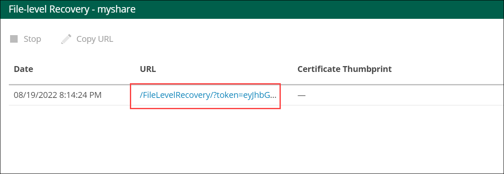
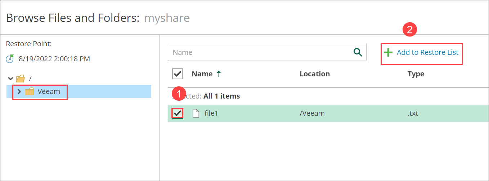
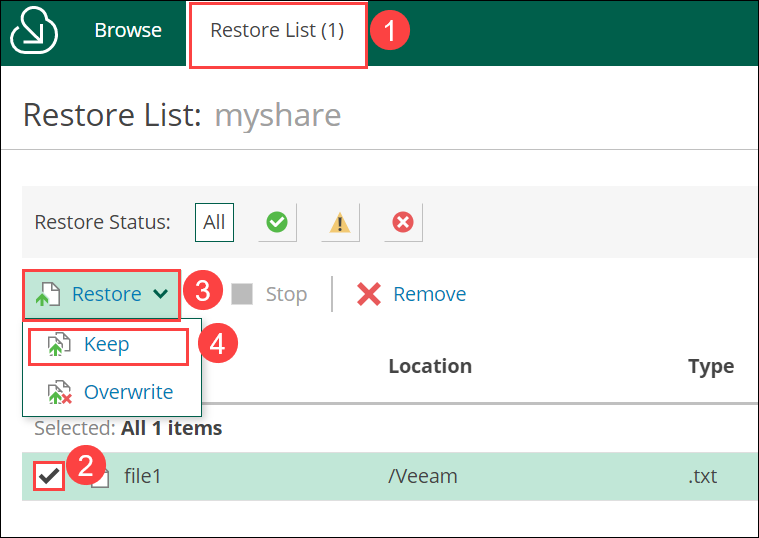

# Exercise 8: Restore Azure File Share

## Overview

In this exercise, we are doing recovery of file share.

## Task 1: Restore Azure File Share

1. From the **Protected Data(1)**, click on **Azure Files(2)** tab and check the checkbox **myshare(3)** under File Share. Click on **Restore(4)** dropdown and then select **File-Level Restore(5)**.
   
   

2. In the **Account(1)** click on **Select account..(2)**.
   
   

3. Select the account and click on **Apply**.
  
   

4. In the **Restore Mode(1)**, click on **Restore to Original location(2)** and click **Next(3)**.
   
   

5. In the **Reason(1)**, enter **File-Level Recovery(2)** for Restore reason and click on **Next(3)**.
   
   

6. In **Summary(1)**, review the configured settings and then click on **Start(2)**.
   
   

7. Select **Protected Data**, click on **Azure Files** tab and click on **FLR** under File-level Recoverly URL
   
   

8. Click on **URL**.
   
   

9. Select the folder named **Veeam**. Check the checkbox for the file **file1(1)** and click on **Add to Restore List(2)**.
   
   

10. Select the **Restore list(1)**, check the checkbox for **file1(2)** and click on **Restore(3)** dropdown and then select option **Keep(4)**.
    
    

Now you have successfully restored the Azure File share and this can be explored in to Azure portal.

**You have Successfully completed the Lab**

