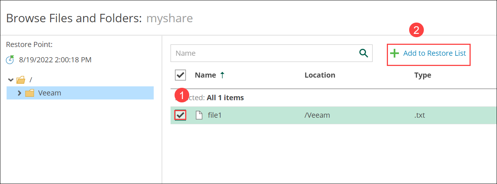

# Exercise 8: Restore Azure File Share

## Overview
In this exercise, we are doing recovery of file share

## Task 1: Restore Azure File Share
1. Select **Protected Data(1)**, within it click on **Azure Files(2)**, check the c**heckbox for File Share(3)**. Click on **Restore(4)** and then **File-Level Restore(5)**.
   
2. In the **Account(1)** click on **Select account..(2)**.
   
3. Select the account and click on **Apply**.
   
4. In the **Restore Mode(1)**, click on **Restore to Original location(2)** and click **Next(3)**.
   
5. In the **Reason(1)**, enter **File-Level Recovery(2)** for Restore reason and click on **Next(3)**.
   
6. Under **Summary(1)**, review the configures setting and then click on **Start(2)**.
   
7. Select **Protected Data**, within it click on **Azure Files** and click on **FLR**.
   
8. Click on **URL**.
   
9. Select the folder named **Veeam**. Check the checkbox for the file **file1(1)** and click on **Add to Restore List(2)**.
   
10. Select the **Restore list(1)**, check the checkbox for **file1(2)**, click on **Restore(3)** and select an option **Keep(4)**.
    
