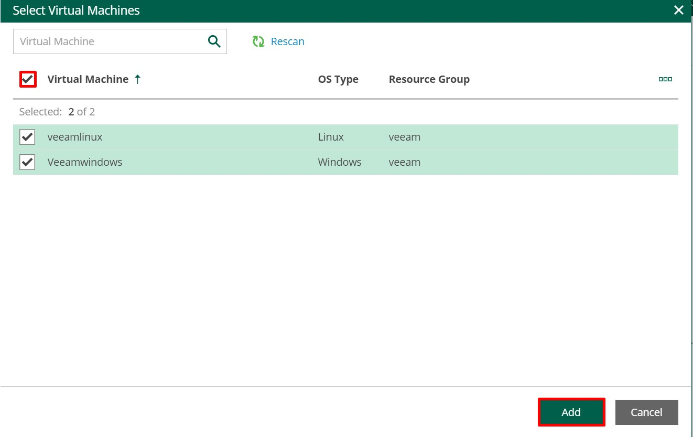

#  Veeam Hands-on Lab for Microsoft Azure
## Login to Veeam VM
1. Copy the Public IP address from the VM and Note the **Username** and **Password** from the azure portal
2. Open the new browser and paste the value copied below and replace the **IPADDRESS** with the Veeam VM IP address
  `````
  https://IPADDRESS
  `````

3. Click on the **advance**

4. Click on the **click on processed to IP**

5. Enter the **Username** and **Password** and click on Login

6. Check all the check boxes in the licence agreement and click on **Accept** and login into the VM


## Add a Microsoft azure account
1. Click on add a microsoft azure account first

2. Click on **Add**

3. Enter the **Name**, **Description** and click on the **Next**

4. In the **Service Account Type** click on **Specify the exisiting service account**

5. Copy the **TenantID**, **Application ID** and **Secret** of service principal from environment details Tab

6. Paste the Copied values in the respective fields and click **Next**

7. Move to the **Summary** and click **Finish** to setup the microsoft account


## Add the Workers to Workspace
1. Go to **Getting Started page** and **click on Review workers configuration**

2. Click on **+Add**

3. Click on **region** and select the region of the resource group and **Apply** and Click **Next**

4. Select the **Virtual Network**, **Subnet** and **Network security Group** and **Next**

5. Click on **Finish**

6. Click on **profile** and **+Add**

7. Select the **Region**, select the proper region and click on **add** and click on **Next**

8. Move to the **worker profile** and click **Next**

9. Go to **summary** and click **Finish**

10. Move to **instance** tab and verify instance is created if it is still in creating state wait till it move to created state


## Add the repository
1. Move to **Getting Started** page and click on **Add repository**

2. Click on **+Add**

3. Enter the **Name** and **Discription** and Click **Next**

4. Select the **storage account**, **Conatiner** and create the **NewFolder** and **Next**

5. Select the **Option** and click **Next**

6. Click on **Summary** and **Finish**

7. Verify that the repository is creation in success state.


## Create Backup policy for Virtual Machines
1. Move to **Getting started page** and **Create your first policy**

2. Click on **+Add**

3. Click on **PolicyInfo** enter the **Name** and **Description** and click **Next**

4. Select the **Azure Active Directory**, select the directory which is given in the azure and select the **Region**

5. Select the  **All resource**

6. Select the **protect the following resources** and **Browse to select the specific resource from the global list**

7. Select the checkbox for virtual machine and click on **ADD**

8. Click on **APPLY**

9.Click on **Next**

10. Move to **Guest processing** and **Enable application aware snapshots** and click **Next**

11. Select the **Targets** and **Enable Backup:on** click **Next**

12. Select the **Schedule**, **Daily Retension:On** and **Edit Daily Settings**

13. Select the **Repository** : **Azure Backup**, Click on **Apply** and Click **Next**

14. Select the **Settings** click **Next**

