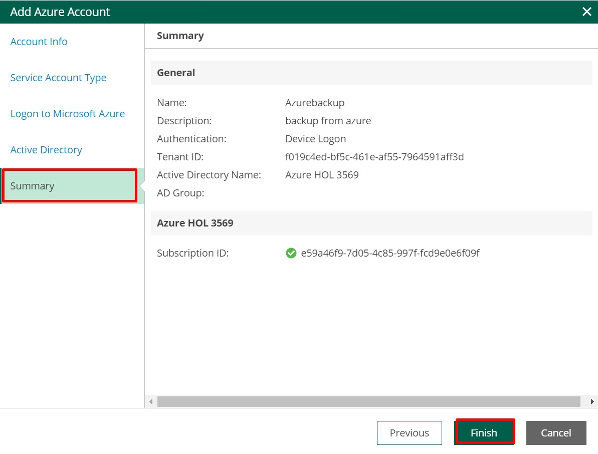
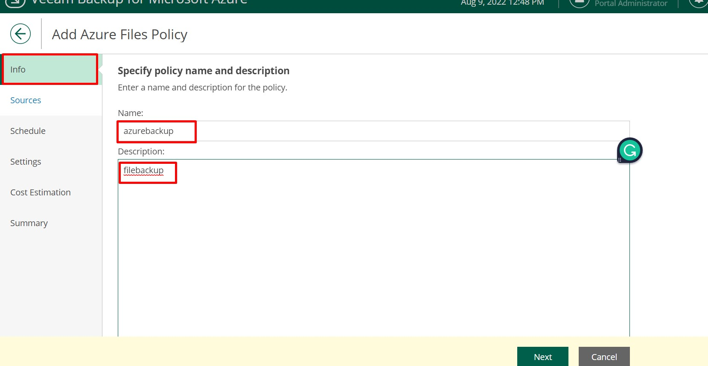
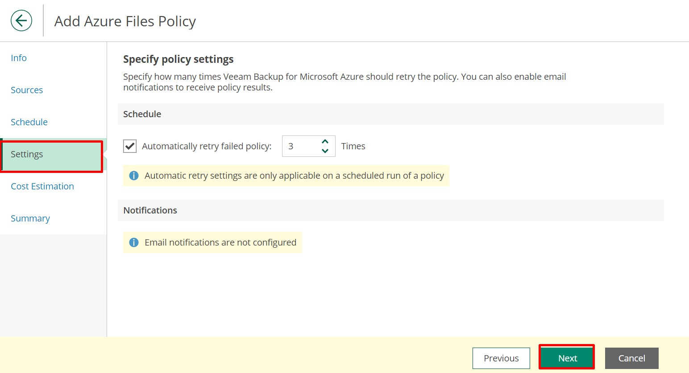
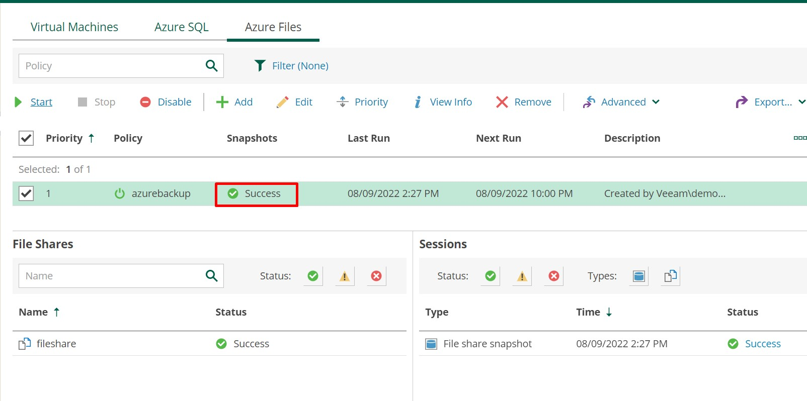

#  Veeam Hands-on Lab for Microsoft Azure
## Login to Azure portal
1. Once the VM is launched, open the Edge browser shortcut named **Azure Portal**

 
 
2. Click on the **Environment details** and followed by **Azure Credentials**  login with the **Username** and **Password**

 
 
3. Login to Azure Portal.

 

## Deploy Veeam VM

1. After login in to the Azure Portal. Search for **Veeam Backup for Microsoft Azure Free Edition** in search bar and click on **Veeam Backup for Microsoft Azure Free Edition**


2. Click on **Create**


3. Enter the below details for virtual machine
   `````
   Resource Group: Veeam
   Virtual machine name: Veeam
   Region: EastUS2
   Size: Standard_DS1_V2
   Username: demouser
   Password: Password.1!!
   
   `````


4. Click on **Review+Create** and then Click on **Create**


5. Make sure that deployment status is **Success**


6. Once the deployment got succeeded, click on **Go to resource** or search for the **Virtual Machines** in search bar.

   

7. Select the Virtual machine with the name **Veeam**


8. Select the Overview and copy **Public IP Address**


**Note**: Wait for **3 minutes** before moving to the next step

## Login to Veeam VM
1. Open the new/incognito browser and paste the value copied below and replace the **IPADDRESS** with the Veeam VM Public IP Address
  `````
  https://IPADDRESS
  `````


2. Click on the **advance**


3. Click on the **continue to IP** to access the website.


**Note**: Wait till the initial steup completes and status changes to **Success**


4. Enter the **demouser** for username and **Password.1!!** for Password and click on **Login**


5. Check all the **Check Boxes** related to licence agreement and click on **Accept** and login into the VM


## Add a Microsoft Azure Account

1. Click on **Add a Microsoft Azure account first**


2. Click on **Add**


3. Enter the **Name**: **AzureBackup**, **Description**: **Add a Microsoft Azure Account** and click on **Next**


4. Under **Service Account Type** choose **Specify exisiting service account** and then click on **Next**


5. Copy the **TenantID**, **Application ID** and **Secret key** of service principal from environment details Tab


6. Paste the copied values in the respective fields and click on **Next**

   **Note**: Please igore if you get any warning notification.


7. Move to the **Summary** and click on **Finish** to setup the Microsoft account.



## Add the Workers to Workspace

1. Go to **Getting Started page** and click on **Review workers configuration**


2. Click on **+Add**


3. Click on **Choose** adjacent to **Region** and select the region of the resource group, click on **Apply** and then click **Next**


4. Select the **Virtual Network**: **Veeamvm-vnet**, **Subnet**: **default** and **Network Security Group**: **veeam-nsg** and click **Next**


5. Click on **Finish**


6. Click on **Profile** tab on top and click **+Add**


7. Select the resource group **Region**, click on **Add** and then click on **Next**


8. Under **Worker Profiles**, leave everything default and click on **Next**


9. Under **Summary**, click on **Finish** to complete.


10. Move to **Instances** tab and verify instance is created if it is still in creating state wait until it is **Created**


## Add repository
1. Move to **Getting Started** page and click on **Add repository**


2. Click on **+Add**


3. Enter the **Name**: **AzureBackup** and **Description**: **Creation of repository** and click on **Next**


4. Select the **Storage account**: **veeamstrDID**, **Container**: **veeamcontainer** and create the new folder with name **azurebackup** and click on **Next**


5. Go through the configuration under **Option** section and click on **Next**


6. Click on **Finish** in Summary page.


7. Verify that the repository creation is **Succeed**.


## Create Backup policy for Virtual Machines
1. Click on **Configuration** in the upper left corner of screen, click on **Getting started page** and **Create your first policy**


2. Click on **+Add**


3. Under **Policy Info** section enter the **Name**: **Virtual Machine Backup** and **Description**: **Creation of Backup for virtual Machine** and click on **Next**


4. Click on **Azure Active Directory**, select the directory which is given in the azure and select the **Region** same as resource group then click on **Next**.


5. Click on **Select resources to protect** under **Resource** section. Choose **All resources** and then **Apply** the changes.


6. Choose **Protect the following resources** and click on **Browse to select the specific resource from the global list**


7. Check the boxes for **veeamLinux-DID** and **WinVm-DID** and click on Add


8. Click **Apply**


9.Click on **Next**


10. Under **Guest processing** section enable the feature **Enable application-aware snapshots** and click **Next**


11. **Enable Backups: On** click **Next** under **Targets** section.


12. Under **Schedule** section, enable **Daily Retension: On** and click om **Edit Daily Settings**


13. Select the **Repository** : **Azure Backup**, Click on **Apply** and Click **Next**


14. Under **Settings** leave defaults and click on **Next**


15. Select the **Cost Estimation** and review the cost estimation and click **Next**


16. Review the **Summary** section and click on **Finish**


17. Select the **Checkbox** priority filter and click on **Start**
    **Note**: Wait and proceed after backup is **Successful**


18. Verify that the backup and snapshot creation is **success**


## Delete the Windows Virtual Machines
1. Login to the Azure Portal using the credentials from Environment details.

2. Search for the Virtual Machine in Azure search bar and select **winvm-DID** VM and **Delete**.


3. Select the **Winvm-DID** and check the checkbox for confirmation and click **delete** wait untill it is deleted


## Restoring the Windows Virtual Machine
1. Navigate to Veeam web portal. Select **Protected Data** and select the restore point of the **winvm-DID**


2. Click on **Restore** dropdown and then select **VM Restore**


3. Select **Winvm-DID** and click **Next**


4. Under **Account** section click on **Select Account** and **Select Azure Active Directory** then click **Apply** and then **Next**.


   **Note**: If the Warning window is popup click on **Continue**

5. Within **Restore Mode** select the **Restore to Original Location** and click **Next**


6. Go to **Reason** provide the **Restore Reason**: **VM deleted** and click **Next**

 

7. Go through **Summary** and click on **Restore**


8. Go to Session Logs and verify that VM restore is in success state and Verify **winVM-DID** is recoverd


## Azure SQL Backup

1. Navigate to **Policies**, select the **Azure SQL** and **+Add**


2. Under **PolicyInfo** section enter value for **Name**: **Sql backup** and **Description**: **Creating Sql backup** and click **Next**


3. Within **Sources** section click and select the **Azure Active Directory** and click on **Choose regions** under Region.


4. Select the Resource Group Region, click on **Add** and click on **Apply**


5. Click on **Resource to Protect**, choose **Protect the following resources** and click on **Browse to select the specifid source from global list**


6.Select the **SamepleDB** and click on **Add**, then click on **Apply** and click on **Next**


7. Under **Processing Options**, select **Use staging servers (recommended for database consistency)** and Click on **Choose server**


8. Click on **Browse** option for **Staging server** and click on **+Add** for adding SQL account


9. Provide the details to create Sql account **Name**: **Sql Account** and **Description**: **Create Sql Account** and click on **Next**


10. Select the Account Enter the **Username**: **sqladmin** ,**Password**: **Password.1!!** and click **Next**


11. Verify summary and click on **Finish**


12. Select **Apply** and click **Next**


13. Under **Schedule**, Enable radio button for **Daily retention** and **Edit Daily Settings**


14. Select **Repository** for AzureBackup, Click **Apply**  and click **Next**


15. Leave defaults under **Settings** and click **Next**


16. Leave defaults within **Cost Estimation** and click **Next**


17. Verify the summary and click **Finish**


18. Navigate to **Policies**, select **Azure SQL** and select the **Priority** checkbox then click on **Start**


19. Make sure that backup is **Success**


## Delete the SQL Database
1. Move to Azure Portal Search for the **SQL databases** and open the database **sampleDB**.

2. Select the overview of **SQL Database** and click on **Delete**

3. **yes** and click on **Delete**

**Note**:Wait untill deletion is success

## Recovery of SQL Database
1. Move to **protect data** ,select **Azure SQL**,Select the **checkbox for the Azure SQL** and Click on **restore database** 

2. Goto **Databases**, Select the **SQLdatabase** and Click on **Next**

3. Goto **Accounts**, **select the Account**, Select the Account given, click **Apply** and **Next**

4. Goto **Restore Mode**, select the checkbox for **Restore to the original location** and click **Next**

**Note**:If warning window is popup click on **Continue**
5. Goto **SQL Account**,select **Account**, click **Apply** and **Next**

6. Goto **Reason**,**enter Reason**:**Sql deleted** click **Next**

7. Select **Summary** click on **Restore**

8. Move to **session log** please verif that Sql Restore is **Success**, if it is not success wait untill it move to success state.


## Recovery of files from Linux Virtual Machine.
1. Move to **protected data**, Select **VeeamLinux-DID**, Click on **Restore** and **file-level-recovery**

2. Click on **Virtual Machine** click on **change restore point** select the restore point and **APPLY** Click **Next**

3. Click on **Restore** enter **Restore reason**:**filerestore** click **Next**

4. Click on **Summary** and click **Start**

Note : Wait till the creation of the link
5. Move to **Protected Data**, select the **Virtual machine**, Select **File-Level-Recovery** and click on **FLR**

6. Select the **URL** and open in the **New Browser**

Note: If you prompted with the **connection is not private** then click on **Advance** and click on **continue to**
 
 7. Move to **var/lib/waagent/custom-script/download/0** Select the **file1.txt** file and click on **+Add to restore list**
 
 8. Move to **Restore List**, Select the file which you want to download and click on **Download**
 

## Backup of Azure Files
1. Navigate to **Policies > Azure Files** and Click **Add**.

2. Provide the **Name**:**file backup** and **Discripition**:**create file backup** for **Info**

3. Go to the **sources** and In the **Account** section select the **Configure account** and select the **Azure Active Dierctory** and Select the **ResourceGroup Region**

4. Click on **Resource to protect** and select the **File Share** from the **Browse to select the specific resource from global list**, Click on **Apply** and Click **Next**. 

Note: If is file share is not available click on **refersh**
5. Move to **Schedule** and enable the **Daily Retension**

6. Move to **Settings** and Click on **Next**

7. Move to **cost estimation** review **cost estimation** and click on **Next**

8. Move to **Summary** and Click on **Finish**

9. Move to **Policies**, Click on **Azure Files**, Check the **Priority** box and Click on **Start**

10. Make Sure that Snapshot creation is **success**


## Recovey of Azure Files
1. Move to **Protect Data**,click on **Azure Files**, Check **Priority**, click on **Restore** and **File-Level Restore**

2. Click on **Account**, Select **Account** and Click **Apply** and **Next**

3. Move to **Restore Mode**, Restore to **Original Location** and click **Next**

4.Move to the **Reason**:**File level recovery**,Enter **Reson** and Click **Next**

5. Move to **summary** and Click on **Start**

6. Move to **Protected Data**, Click on **Azure Files** and Click on **FLR**

7. Click on the URL it will redirect to the another Tab.

8. Select the **files** and click on **Add to Restore**

9. Select the **Restore list**,click on the check box of file, click on **restore** and click on **keep**.

